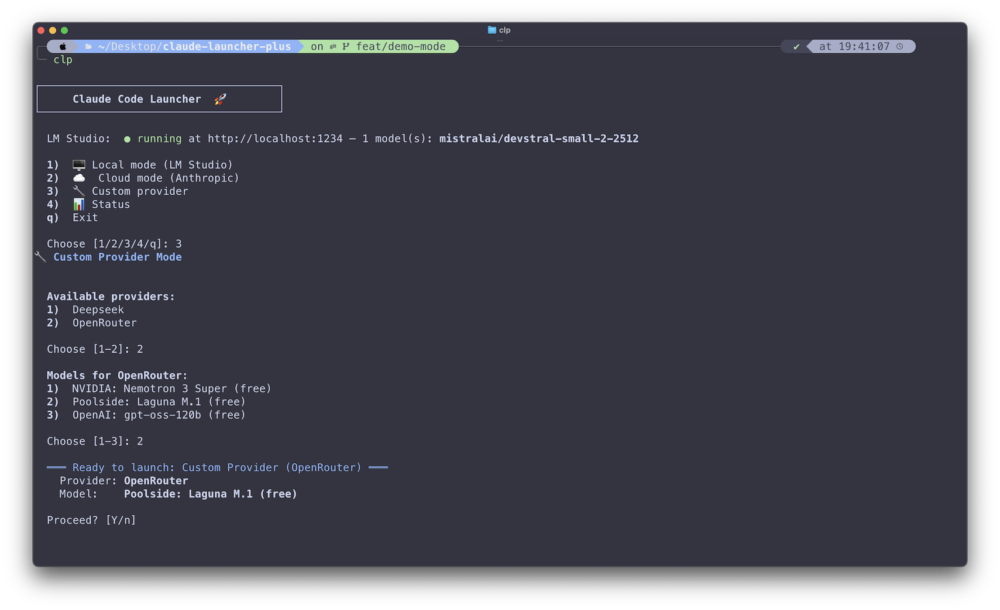

# Claude Launcher Plus

[](LICENSE)
[]()
[]()
[](https://github.com/moodyreplicant/claude-launcher-plus/actions/workflows/ci.yml)
[](https://github.com/psf/black)
[]()

[](https://github.com/PyCQA/bandit)

An enhanced launcher for [Claude Code](https://docs.anthropic.com/en/docs/claude-code) with support for **local** (LM Studio), **cloud** (Anthropic OAuth), and **custom provider** modes (DeepSeek, OpenRouter, or any Anthropic-compatible API).

> **v3.1.0** — Naming consistency, SHA-256 checksums in releases, and branding cleanup.

<p align="center">
  <a href="clp.png">
    
  </a>
</p>

### Why This Exists

Claude Code normally requires an Anthropic API key or OAuth login. The original [claude-code-offline-local-models](https://www.gui.codes/articles/claude-code-offline-local-models) guide by [@gmotzespina](https://github.com/gmotzespina) showed how to redirect Claude Code to a local LM Studio instance — unlocking offline use and freedom from API rate limits.

**Claude Launcher Plus** builds on that foundation, adding:
- A unified menu for local, cloud, and custom provider modes
- Static model selection so you can switch between multiple models per provider without editing files
- DeepSeek and OpenRouter support out of the box
- CLI subcommands for scripting and automation
- **v3.1.0:** Naming consistency, SHA-256 checksums in releases, branding cleanup

---

## What It Does

- **3 launch modes** — pick local, cloud, or custom provider from an interactive menu or CLI flag
- **Auto-detect LM Studio models** — discovers loaded LLMs on your machine and presents a picker
- **Custom providers with model picker** — configure providers in `~/.claude/providers.json` and choose from multiple static models per provider
- **Zero-config cloud mode** — launches standard Claude Code with your Anthropic account
- **Menu returns after exit** — the interactive loop continues after Claude Code closes (no more `exec`)

---

## Prerequisites

| Dependency | Check | Needed For |
|-----------|-------|------------|
| `python3` 3.11+ | `python3 --version` | Runtime (macOS 14+ ships 3.11+) |
| `claude` | `claude --version` | Claude Code CLI (installed separately) |
| `curl` | `curl --version` | LM Studio health checks (optional — `urllib` fallback) |

---

## Installation

### Quick User Install (macOS & Linux)

For everyday use — no Python tooling required beyond `python3`:

```bash
git clone https://github.com/moodyreplicant/claude-launcher-plus.git
cd claude-launcher-plus
bash install.sh              # user install (default)
```

Installs:
- The launcher package to `~/.local/share/claude-launcher-plus/`
- A wrapper script at `~/.local/bin/claude-launcher-plus`
- Optionally sets up the `clp` alias and adds to PATH

No `pipenv`, no virtualenv — runs directly with your system Python.

### Developer Install

For contributing, testing, or modifying the launcher:

```bash
git clone https://github.com/moodyreplicant/claude-launcher-plus.git
cd claude-launcher-plus
bash install.sh --dev        # developer install
```

The `--dev` flag additionally:
- Installs all Python dependencies via `pipenv install --dev`
- Sets up pre-commit hooks (`pre-commit install`)
- Creates a pipenv-aware wrapper script

After a dev install, run `pipenv run python3 claude-launcher-plus.py` or
use the wrapper at `~/.local/bin/claude-launcher-plus`.

### Windows

**PowerShell (recommended):**

```powershell
git clone https://github.com/moodyreplicant/claude-launcher-plus.git
cd claude-launcher-plus
powershell -ExecutionPolicy Bypass -File install.ps1
```

Installs to `%LOCALAPPDATA%\Programs\claude-launcher-plus\` and adds to your user PATH.

**Manual (CMD or PowerShell):**

```cmd
copy claude-launcher-plus.py %LOCALAPPDATA%\Programs\claude-launcher-plus\
copy claude-launcher-plus.bat %LOCALAPPDATA%\Programs\claude-launcher-plus\
```

Then add the folder to your PATH, or run via the `.bat` wrapper.

---

## Configuration

### Custom Providers (v2 — recommended)

Copy the template:

```bash
mkdir -p ~/.claude
cp providers.json ~/.claude/providers.json
```

**v2 format uses `$VAR` references** — your API keys stay in environment variables, never in the config file:

```json
{
  "version": 2,
  "providers": {
    "Deepseek": {
      "description": "DeepSeek API (Anthropic-compatible endpoint)",
      "website": "https://platform.deepseek.com",
      "env": {
        "ANTHROPIC_BASE_URL": "https://api.deepseek.com/anthropic",
        "ANTHROPIC_AUTH_TOKEN": "$DEEPSEEK_API_KEY",
        "ANTHROPIC_MODEL": "deepseek-v4-pro[1m]",
        "ANTHROPIC_DEFAULT_OPUS_MODEL": "deepseek-v4-pro[1m]",
        "ANTHROPIC_DEFAULT_SONNET_MODEL": "deepseek-v4-pro[1m]",
        "ANTHROPIC_DEFAULT_HAIKU_MODEL": "deepseek-v4-flash[1m]",
        "CLAUDE_CODE_DISABLE_NONESSENTIAL_TRAFFIC": "1",
        "CLAUDE_CODE_EFFORT_LEVEL": "max"
      },
      "models": [
        {
          "name": "Deepseek V4 Pro (1M ctx)",
          "env": {
            "ANTHROPIC_MODEL": "deepseek-v4-pro[1m]",
            "ANTHROPIC_DEFAULT_OPUS_MODEL": "deepseek-v4-pro[1m]",
            "ANTHROPIC_DEFAULT_SONNET_MODEL": "deepseek-v4-pro[1m]",
            "ANTHROPIC_DEFAULT_HAIKU_MODEL": "deepseek-v4-flash[1m]"
          }
        },
        {
          "name": "Deepseek V4 Flash (1M ctx)",
          "env": {
            "ANTHROPIC_MODEL": "deepseek-v4-flash[1m]",
            "ANTHROPIC_DEFAULT_OPUS_MODEL": "deepseek-v4-flash[1m]",
            "ANTHROPIC_DEFAULT_SONNET_MODEL": "deepseek-v4-flash[1m]",
            "ANTHROPIC_DEFAULT_HAIKU_MODEL": "deepseek-v4-flash[1m]"
          }
        }
      ]
    },
    "OpenRouter": {
      "description": "OpenRouter — unified API for many model providers",
      "website": "https://openrouter.ai",
      "env": {
        "OPENROUTER_API_KEY": "$OPENROUTER_API_KEY",
        "ANTHROPIC_BASE_URL": "https://openrouter.ai/api",
        "ANTHROPIC_AUTH_TOKEN": "$OPENROUTER_API_KEY",
        "ANTHROPIC_MODEL": "poolside/laguna-m.1:free",
        "CLAUDE_CODE_DISABLE_NONESSENTIAL_TRAFFIC": "1",
        "CLAUDE_CODE_EFFORT_LEVEL": "max"
      },
      "models": [
        {
          "name": "NVIDIA: Nemotron 3 Super (free)",
          "env": { "ANTHROPIC_MODEL": "nvidia/nemotron-3-super-120b-a12b:free" }
        },
        {
          "name": "Poolside: Laguna M.1 (free)",
          "env": { "ANTHROPIC_MODEL": "poolside/laguna-m.1:free" }
        },
        {
          "name": "OpenAI: gpt-oss-120b (free)",
          "env": { "ANTHROPIC_MODEL": "openai/gpt-oss-120b:free" }
        }
      ]
    }
  }
}
```

Then export your keys in your shell profile (`~/.zshrc`, `~/.bashrc`, or `~/.profile`):

```bash
export DEEPSEEK_API_KEY="sk-your-key"
export OPENROUTER_API_KEY="sk-or-your-key"
```

**v1 format (plaintext keys) is still supported** — the launcher detects the absence of `"version"` and handles v1 transparently.

**How models work:**
- If a provider has a `models` array, you pick from it after selecting the provider
- Model-level `env` vars are merged on top of provider-level `env` (model overrides provider)
- If a provider has no `models` array, the provider-level env is used as-is

---

## Usage

### Interactive Menu

```bash
clp
# or: python3 claude-launcher-plus.py
```

### CLI Commands

```bash
# Launch modes
clp local               # LM Studio
clp cloud               # Anthropic OAuth
clp custom              # Custom provider (with model picker)

# Status & discovery
clp status              # Show config + LM Studio status
clp list-providers      # List configured providers
clp list-models OpenRouter   # List models for a provider
clp check-deps          # Check all required dependencies

# Validation (no launch)
clp --dry-run           # Validate all configs + connectivity
clp --dry-run custom    # Validate specific mode

# Options
clp --verbose           # Enable debug logging
clp --non-interactive   # Skip all prompts (for scripts/CI)
clp --allow-scripts     # Allow key helper script generation
clp --help
clp --version
```

---

## Settings Management

### Which keys the launcher manages

The launcher writes to `~/.claude/settings.json` to configure the active provider.
It **only touches these keys** — everything else you set is preserved across mode switches.

| Key | Purpose | Set By |
|-----|---------|--------|
| `apiKeyHelper` | Path to auth script | `local` mode |
| `env.ANTHROPIC_BASE_URL` | API endpoint | `custom` mode |
| `env.ANTHROPIC_MODEL` | Model ID | `custom` mode |
| `env.ANTHROPIC_AUTH_TOKEN` | API key | `custom` mode |
| `env.CLAUDE_CODE_DISABLE_NONESSENTIAL_TRAFFIC` | Telemetry off | `custom` mode |
| `env.CLAUDE_CODE_EFFORT_LEVEL` | Effort/thinking | `custom` mode |
| `env.ANTHROPIC_DEFAULT_{OPUS,SONNET,HAIKU}_MODEL` | Default model aliases | `custom` mode |
| `env.OPENROUTER_API_KEY` | OpenRouter key | `custom` mode (OpenRouter) |

### Preserving your personal settings

Claude Code merges settings from **three scopes**, with higher scopes overriding lower:

| Scope | Location | Priority | Touched by launcher? |
|-------|----------|----------|---------------------|
| User (global) | `~/.claude/settings.json` | Lowest | **Yes** — provider config written here |
| Project | `.claude/settings.json` | Medium | No |
| **Local** | `.claude/settings.local.json` | **Highest** | **No** |

**Recommended:** Put personal settings in `.claude/settings.local.json` in your project.
The launcher never touches this file.

---

## Upgrading from v1.x (bash launcher)

If you installed the old bash-based launcher (v1.0.0–v1.3.0), just run the new installer:

```bash
git pull
./install.sh
```

Your `providers.json` and `settings.json` are preserved. The `clp` alias continues working.
The old `api-key-helper.sh` is regenerated with restricted permissions on next local-mode launch.

To roll back, check out the `v1.3.0` tag and run `install.sh` from there.

---

## Environment Variables

| Variable | Default | Description |
|----------|---------|-------------|
| `LM_STUDIO_HOST` | `localhost` | LM Studio server hostname |
| `LM_STUDIO_PORT` | `1234` | LM Studio server port |
| `LM_STUDIO_API_KEY` | `lm-studio` | LM Studio API key |
| `NO_COLOR` | (unset) | Disable colored output |

**Provider API keys** (v2 format — set these in your shell profile, not in providers.json):

| Variable | Provider |
|----------|----------|
| `DEEPSEEK_API_KEY` | Deepseek |
| `OPENROUTER_API_KEY` | OpenRouter |

---

## Uninstall

```bash
# Run the uninstaller from the cloned repository
./uninstall.sh
```

The uninstaller will:
- Confirm before removing the binary
- Offer to remove `~/.claude/providers.json` (your provider config)
- Offer to remove `~/.claude/api-key-helper.sh` (LM Studio auth helper)
- Offer to clean up the PATH entry added by the installer
- Leave Claude Code's own files (`~/.claude/settings.json`) untouched

---

## Development

### Quick Start (after `install.sh --dev`)

```bash
# Activate the dev environment
pipenv shell

# Or run individual commands
pipenv run python3 claude-launcher-plus.py --dry-run  # test the launcher
pipenv run pytest tests/                               # run all 123 tests
pipenv run mypy claude_launcher/                       # static type check (0 errors)
pipenv run pre-commit run --all-files                  # run all lint hooks
```

### Project Structure

```
claude-launcher-plus.py     # Entry point shim (→ claude_launcher.cli:main)
claude_launcher/
  __init__.py               # VERSION constant
  cli.py                    # Argument parsing, dispatch, dry-run
  config.py                 # Settings load/save, path constants, directory permissions
  launcher.py               # Launch modes, LM Studio client, status, interactive menu
  logger.py                 # Structured logging: JSON + human-readable, rotation, secret redaction
  providers.py              # Provider config, $VAR resolution, JSON Schema validation
  utils.py                  # Color helpers, atomic write, input sanitization, file locking
providers.schema.json       # JSON Schema for providers.json
tests/                      # 123 tests across 9 test files
  test_cli.py               # CLI argument parsing
  test_config.py            # Settings management, permissions
  test_integration.py       # End-to-end launch workflows (mocked)
  test_launcher.py          # LM Studio, status, dependency checks
  test_logger.py            # Formatters, file output, secret redaction
  test_providers.py         # Schema validation, $VAR resolution
  test_utils.py             # Atomic write, safe read, checksums, file locking, colors
```

### Two Install Modes

| Mode | Command | Pipenv | Pre-commit | Use case |
|------|---------|--------|------------|----------|
| **User** | `bash install.sh` | ❌ | ❌ | Everyday launcher use |
| **Dev** | `bash install.sh --dev` | ✅ | ✅ | Contributing / testing |

The user install copies the package to `~/.local/share/claude-launcher-plus/` and runs
directly with `python3`. The dev install adds `pipenv`, virtualenv isolation,
pre-commit hooks, and all dev dependencies.

### Key Design Decisions

| Decision | Rationale |
|----------|-----------|
| `pipenv` over `requirements.txt` | Deterministic lock file with hash verification |
| Standard library `urllib` instead of `requests` | Zero external runtime dependencies (besides `jsonschema`) |
| `os.replace()` for atomic writes | Crash-safe file updates on all platforms |
| `fcntl.flock` for file locking | Advisory locking prevents concurrent write corruption |
| `$VAR` env-var references | API keys stay in environment, never in config files |
| `NO_COLOR` compliance | Respects the no-color.org convention |
| JSON Schema validation | Runtime validation of `providers.json` with clear error messages |

### Running Tests

```bash
pipenv run pytest tests/                    # all tests
pipenv run pytest tests/ -v                # verbose
pipenv run pytest tests/ --cov=claude_launcher/  # with coverage
```

### Key Design Decisions

| Decision | Rationale |
|----------|-----------|
| `pipenv` over `requirements.txt` | Deterministic lock file with hash verification |
| Standard library `urllib` instead of `requests` | Zero external runtime dependencies (besides `jsonschema`) |
| `os.replace()` for atomic writes | Crash-safe file updates on all platforms |
| `fcntl.flock` for file locking | Advisory locking prevents concurrent write corruption |
| `$VAR` env-var references | API keys stay in environment, never in config files |
| `NO_COLOR` compliance | Respects the no-color.org convention |
| JSON Schema validation | Runtime validation of `providers.json` with clear error messages |

### Migration from Single-File Version

If you have the old single-file launcher (pre-3.0.0), the git history preserves the
original code at earlier commits. The package structure (`claude_launcher/`) was
introduced in Phase 1 of the refactor. The entry point `claude-launcher-plus.py`
remains as a thin shim for backward compatibility.

---

**"LM Studio: offline" but server is running**
Make sure the LM Studio API server is started. Check: `curl http://localhost:1234/api/v1/models`

**Custom provider not working**
- Verify `~/.claude/providers.json` exists and has valid JSON
- v2 format: make sure `DEEPSEEK_API_KEY` (or your provider's env var) is exported
- v1 format: check `ANTHROPIC_AUTH_TOKEN` matches your API key
- Run `clp --dry-run custom` to validate without launching

**"Error: 'claude' not found in PATH"**
Claude Code must be installed separately. Run `claude --version` first.
If installed but not found, make sure it's in your PATH. Restart your terminal after installation.

**Dry-run exits with code 1**
Run `clp --dry-run --verbose` to see detailed logs. Common issues:
- A provider has unresolvable `$VAR` references (export the variable first)
- `providers.json` has a schema validation error (run `clp check-deps`)
- The `claude` binary is not installed or not in PATH

**"Missing required dependencies"**
```bash
# macOS
brew install python3

# Ubuntu/Debian
sudo apt install python3

# Windows
winget install Python.Python.3
```
Install [Claude Code](https://docs.anthropic.com/en/docs/claude-code) separately.

**Environment variable not found (v2 providers)**
```
Error: Environment variable 'DEEPSEEK_API_KEY' is not set.
Required by provider 'Deepseek'.
Add 'export DEEPSEEK_API_KEY=<your-key>' to your shell config and restart your shell.
```
Set the variable in `~/.zshrc`, `~/.bashrc`, or `~/.profile` and restart your terminal.

---

## License

MIT — see [LICENSE](LICENSE).

---

## Credits

- **[gui.codes](https://www.gui.codes/articles/claude-code-offline-local-models)** — Original blog post demonstrating Claude Code → LM Studio redirection
- **[@gmotzespina](https://github.com/gmotzespina)** — Creator of the original `claude-launcher.sh`
- This project extends the original with a unified multi-mode menu, custom provider support, static model selection, and a Python rewrite for cross-platform support
- This project was human-orchestrated, with a team of AI agents assisting in every phase—from ideation and coding to testing and documentation.
